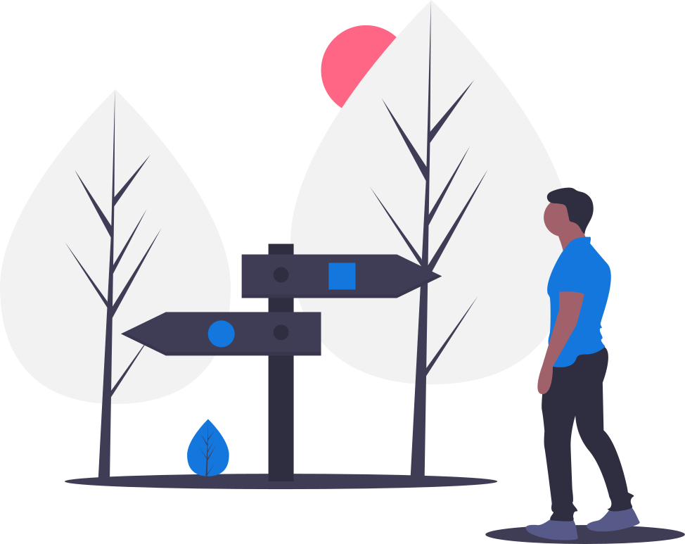

If you use `HttpClientBuilder`, the resulting `HttpClient` will automatically follow up to ten redirects by default.
Automatic following can be customized or disabled (using a limit of `0`) using `HttpClientBuilder::followRedirects()`.

{:.image-60}

## Redirect Policy

Redirects to the same host will clone the request and apply the redirect URI.
If the response status code is `300`, `301`, `302`, or `303`, the request body is removed and the request method changed to `GET`.
Redirects to other hosts will always follow with an empty `Request` using the `GET` method.

## Examining the Redirect Chain

All previous responses can be accessed from the resulting `Response` via `Response::getPreviousResponse()`.
However, the response body is discarded on redirects, so it can no longer be consumed.
If you want to consume redirect response bodies, you need to implement your own interceptor.
