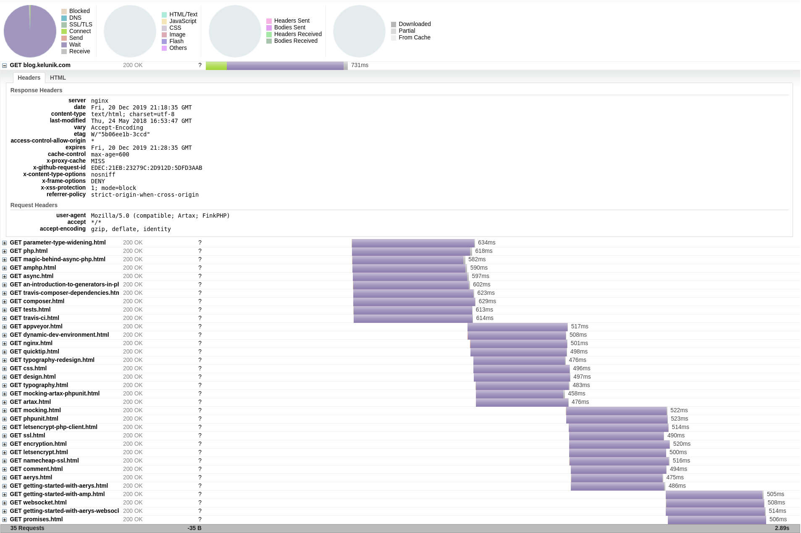

The `LogHttpArchive` interceptor allows logging all requests / responses including detailed timing information to an [HTTP archive (HAR)](https://en.wikipedia.org/wiki/HAR_%28file_format%29).

These log files can then be imported into the browsers developer tools or online tools like [HTTP Archive Viewer](http://www.softwareishard.com/har/viewer/) or [Google's HAR Analyzer](https://toolbox.googleapps.com/apps/har_analyzer/).

{:.warning}
> Be careful if your log files might contain sensitive information in URLs or headers if you submit these files to third parties like the linked services above.

```php
use Amp\Http\Client\HttpClientBuilder;
use Amp\Http\Client\Interceptor\LogHttpArchive;

$httpClient = (new HttpClientBuilder)
    ->intercept(new LogHttpArchive('/tmp/http-client.har'))
    ->build();

$httpClient->request(...);
```


